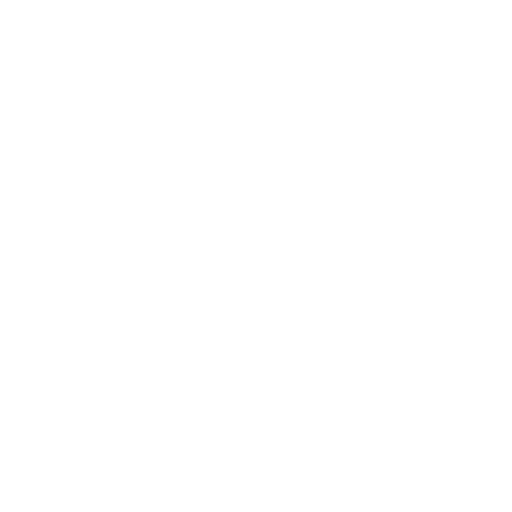
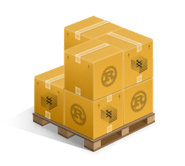

# Polkadot Hackathon LATAM 2022 <!-- .element: class="!text-polkadot" -->

----

## Introducción a Substrate <!-- .element: class="!text-substrate" -->

---

## Presentadores <!-- .element: class="!text-substrate" -->

  
  

---

  

----

  
  
+

  

Clientes basados en Rust desarrollados por Parity Technologies

  
  
Bitcoin

  
  
Ethereum

  
  
Zcash

----

  

    
Blockchain Monolítica

    

      
Ejecución, Consenso & Networking

    

  

  

    
  

  

    
Blockchain Modular

    

        

          
Ejecución

        

        

          
Consenso & Networking

        

    

  

----

  

    
  

  

      

        
Parachain

      

      

        
Relay Chain

      

  

----

Componentes de un cliente

  

    
BD

  

  

    
Networking P2P

  

  

    
Consenso

  

  

    
RPC API

  

  

    
Telemetría

  

  

    
Marco De Ejecución

  

  

    
Ejecución

  

----

  

  

    
Ejecución

  

  

    
Almacenamiento

  

  

    
Networking P2P

  

  

    
Consenso

  

  

    
RPC API

  

    

    
Telemetría

  

  

    
Marco De Ejecución

  

----

  
  
  

---

  

----

## ¿Qué es? <!-- .element: class="!text-substrate" -->

Framework modular para desarrollo de blockchains escrita en Rust

----

## ¿Qué nos provee? <!-- .element: class="!text-substrate" -->

- Interoperabilidad con otras chains
- Módulos reutilizables para armar la lógica de negocio
- Capacidad de evolucionar con el tiempo

Note:
TODO: Leer más de XCM
Esta capacidad de evolucionar con el tiempo está dada debido a que el runtime
(lógica de negocio) puede ser actualizado mediante governanza.

----

## ¿Por qué Rust? <!-- .element: class="!text-substrate" -->

  <ul>
    <li>Seguro</li>
    <li>Rápido</li>
    <li>Liviano</li>
    <li>Compila a WASM</li>
    <li>Divertido :D</li>
  </ul>
  

Note:
Rust es el lenguaje de programación con mejor soporte para compilar a WebAssembly.

----

## Arquitectura <!-- .element: class="!text-substrate" -->

----

  

    <!-- DIAGRAM -->
    

      

        
WASM Runtime

        
      

      <!-- ARROWS -->
      

        

      

      

        

      

      

        

      

      

        

      

    

    

      
Pallets

      <ul class="!list-none space-y-1 !m-0 text-xl">
        <li>Balances</li>
        <li>Uniques</li>
        <li>Custom</li>
        <li>Etc...</li>
      </ul>
    

    

      
Runtime API

      <ul class="!list-none space-y-1 !m-0 text-xl">
        <li>Procesamiento de bloques</li>
        <li>Finalidad</li>
        <li>Transacciones</li>
        <li>Etc...</li>
      </ul>
    

  

  

    <!-- DIAGRAM -->
    

      
Host functions

      <ul class="!list-none !m-0 text-xl">
        <li>Criptografía</li>
        <li>Logging</li>
        <li>Almacenamiento</li>
        <li>Etc...</li>
      </ul>
    

    

      
Componentes

      <ul class="!list-none space-y-1 !m-0 text-xl">
        <li>Libp2p</li>
        <li>Creador de bloques</li>
        <li>Base de datos</li>
        <li>Etc...</li>
      </ul>
    

    

      

        
HOST

        
      

      <!-- ARROWS -->
      

        

      

      

        

      

      

        

      

      

        

      

    

  

Note:
Un nodo de Substrate tiene dos partes, el host y el runtime.
El runtime ejecuta la función de transición de la máquina de estados.
El runtime es una máquina virtual del Rust compilado a WASM.
Este WASM se encuentra en la base de datos del nodo.

----

## ¿Por qué WASM? <!-- .element: class="!text-substrate" -->

- Compacto
- Sandboxed
- Determinista
- Rápido
- Buen soporte

Note:
El runtime (la lógica de negocio) es un blob (binario) de WASM.
Este blob se almacena en la base de datos, lo cual permite que sea actualizado
mediante governanza.

----

## Forkless upgrades <!-- .element: class="!text-substrate" -->

Note:
Debido a que la lógica de la chain está en el almacenamiento, una actualización no
requiere un hard fork, es simplemente procesar un nuevo extrinsic.

----

  

    <!-- DIAGRAM -->
    

      

        
WASM Runtime

        
      

      <!-- ARROWS -->
      

        

      

      

        

      

      

        

      

      

        

      

    

    

      
Pallets

      <ul class="!list-none space-y-1 !m-0 text-xl">
        <li>Balances</li>
        <li>Uniques</li>
        <li>Custom</li>
        <li>Etc...</li>
      </ul>
    

    

      
Runtime API

      <ul class="!list-none space-y-1 !m-0 text-xl">
        <li class="fragment highlight-current-red" data-fragment-index="2">Procesamiento de bloques</li>
        <li>Finalidad</li>
        <li>Transacciones</li>
        <li>Etc...</li>
      </ul>
    

  

  

    <!-- DIAGRAM -->
    

      
Host functions

      <ul class="!list-none !m-0 text-xl">
        <li>Criptografía</li>
        <li>Logging</li>
        <li>Almacenamiento</li>
        <li>Etc...</li>
      </ul>
    

    

      
Componentes

      <ul class="!list-none space-y-1 !m-0 text-xl">
        <li class="fragment text-white highlight-current-red" data-fragment-index="1">Libp2p</li>
        <li>Creador de bloques</li>
        <li class="fragment text-white highlight-current-red" data-fragment-index="3">Base de datos</li>
        <li>Etc...</li>
      </ul>
    

    

      

        
HOST

        
      

      <!-- ARROWS -->
      

        

      

      

        

      

      

        

      

      

        

      

    

  

Note:
Como ejemplo en el diagrama, viene un bloque con un extrinsic de runtime upgrade.
Este bloque llega al host del nodo por la red mediante libp2p.
Luego se llama a la API del runtime actual que se tiene para procesar el bloque
(solo el runtime tiene esta lógica).
Esta lógica determina que se va a sustituír el runtime viejo con el nuevo y el nuevo
se pone en la base de datos.
A partir de aquí se pasa a usar el runtime nuevo porque sustituyó al viejo.

----

## Cumulus <!-- .element: class="!text-substrate" -->

Note:
Cumulus es un proyecto que van a querer utilizar si quieren hacer una parachain con Substrate.
Mientras que Substrate te permite crear una chain con todos los módulos reutilizables que mencionamos,
Cumulus permite que esté pronta para funcionar con una relay chain.
Hay una template para empezar desde cero con Substrate y Cumulus para hacer una parachain, van a querer
empezar con esa en vez de con la substrate-node-template si quieren hacer una parachain.

---

## Frame <!-- .element: class="!text-substrate" -->

  

    
• Acrónimo de "Framework for Runtime Aggregation of Modularized Entities"

    
• Entorno de desarrollo dentro de substrate que provee modulos, llamados Pallets.

    
• Los Pallets proveen funcionalidad especifica que puedes incluir en tu Runtime.

  

  

----

### Pallets <!-- .element: class="!text-substrate" -->

  

    
• Permiten construir una lógica de aplicación usando componentes predefinidos.

    
• Cada Pallet define tipos, elementos de almacenamiento y funciones para implementar una funcionalidad específica.

  

  

    

      
BABE

    

    

      
GRANDPA

    

    

      
Assets

    

    

      
EVM

    

    

      
Identity

    

    

      
Staking

    

      

      
Multisig

    

    

      
Uniques

    

    

      
Contracts

    

  

----

### Estructura General <!-- .element: class="!text-substrate" -->

<pre>
  <code data-trim data-noescape>
    // Imports y dependencias
    pub use pallet::*;

    // Definir el modulo pallet
    #[frame_support::pallet]
    pub mod pallet {
    use frame_support::pallet_prelude::*;
    use frame_system::pallet_prelude::*;

    ...

    }
  </code>
</pre>

----

### Configuracion Principal <!-- .element: class="!text-substrate" -->

<pre>
  <code data-trim data-noescape>
    // Declarar el tipo del pallet, traits y metodos
    #[pallet::pallet]
    #[pallet::generate_store(pub(super) trait Store)]
    pub struct Pallet<T>(_);

    // Configurar el pallet especificando los tipos
    // y parametros de los que depende
    #[pallet::config]
    pub trait Config: frame_system::Config { ... }
  </code>
</pre>

----

### Almacenamiento <!-- .element: class="!text-substrate" -->

<pre>
  <code data-trim data-noescape>
    #[pallet::storage]
    type SomePrivateValue<T> = StorageValue<_, u32, ValueQuery>;

    #[pallet::storage]
    #[pallet::getter(fn some_primitive_value)]
    pub(super) type SomePrimitiveValue<T> = StorageValue<_, u32, ValueQuery>;

    #[pallet::storage]
    #[pallet::getter(fn some_map)]
    pub(super) type SomeMap<T: Config> = StorageMap<_, Blake2_128Concat, T::AccountId, u32, ValueQuery>;
  </code>
</pre>

----

### Eventos <!-- .element: class="!text-substrate" -->

<pre>
  <code data-trim data-noescape>
    // Pallets use events to inform users when important changes are made.
    // Event documentation should end with an array that provides descriptive names for parameters.
    #[pallet::event]
    #[pallet::generate_deposit(pub(super) fn deposit_event)]
    pub enum Event<T: Config> {
      /// Event emitted when a claim has been created.
      ClaimCreated { who: T::AccountId, claim: T::Hash },
      /// Event emitted when a claim is revoked by the owner.
      ClaimRevoked { who: T::AccountId, claim: T::Hash },
    }
  </code>
</pre>

----

### Errores <!-- .element: class="!text-substrate" -->

<pre>
  <code data-trim data-noescape>
    #[pallet::error]
    pub enum Error<T> {
      /// The claim already exists.
      AlreadyClaimed,
      /// The claim does not exist, so it cannot be revoked.
      NoSuchClaim,
      /// The claim is owned by another account, so caller can't revoke it.
      NotClaimOwner,
    }
  </code>
</pre>

----

### Despachables <!-- .element: class="!text-substrate" -->

<pre>
  <code data-trim data-noescape>
    // Add functions that are callable
    // from outside the runtime.
    #[pallet::call]
    impl<T:Config> Pallet<T> { ... }
  </code>
</pre>

---

### Recursos <!-- .element: class="!text-substrate" -->

  

    <a class="text-2xl p-6" href="https://github.com/substrate-developer-hub/substrate-node-template">Substrate Node Template</a>
  

  

    <a class="text-2xl p-6" href="https://github.com/paritytech/substrate/tree/master/frame">FRAME Pallets</a>
  

  

    <a class="text-2xl p-6" href="https://github.com/substrate-developer-hub/substrate-front-end-template">Substrate Frontend Template</a>
  

  

    <a class="text-2xl p-6" href="https://learn.figment.io/tutorials/substrate-kitties-setup">Substrate Kitties</a>
  

  

    <a class="text-2xl p-6" href="https://github.com/substrate-developer-hub/substrate-parachain-template">Substrate Parachain Template</a>
  

  

    <a class="text-2xl p-6" href="https://docs.substrate.io/quick-start/">Documentación de Substrate</a>
  

